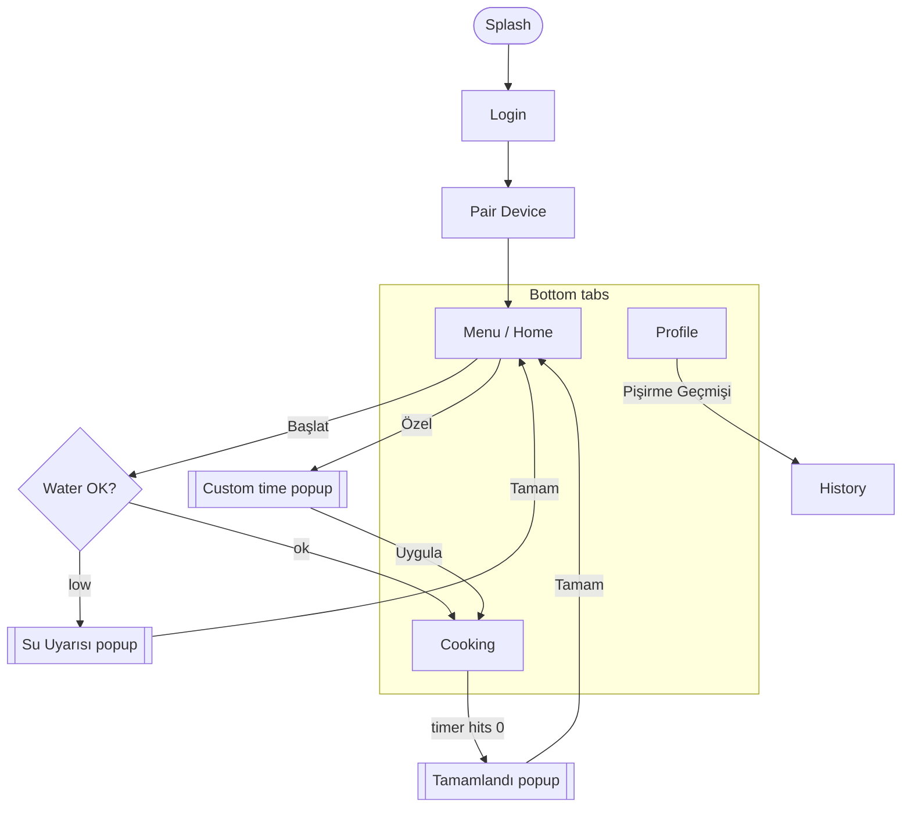

<div align="center">

# 🥚 EggChef

**The mobile app for the Vestel EggChef smart egg cooker.**
Pick how many eggs, choose your doneness, hit start — and watch them cook, live.

[](https://expo.dev)
[](https://reactnative.dev)
[](https://www.typescriptlang.org)
[](#-run-it-on-the-ios-simulator-start-here)
[](./LICENSE)

</div>

---

A **CENG318 (Human–Computer Interaction)** group project. This README is written so that **anyone on the team can clone the repo and have it running in the iOS simulator in ~15 minutes** — no prior React Native experience required.

> 🆕 **First time here?** Read [What is EggChef?](#-what-is-eggchef) → [Run it on the iOS simulator](#-run-it-on-the-ios-simulator-start-here) → [How it works](#-how-it-works-the-2-minute-version). That's enough to be productive.

## 📚 Table of contents

- [What is EggChef?](#-what-is-eggchef)
- [Features](#-features)
- [Screens & flow](#-screens--flow)
- [Tech stack](#-tech-stack)
- [Run it on the iOS simulator](#-run-it-on-the-ios-simulator-start-here) ← start here
- [Project structure](#-project-structure)
- [How it works](#-how-it-works-the-2-minute-version)
- [API & device contract](#-api--device-contract)
- [Apple Watch app](#-apple-watch-app)
- [Scripts](#-scripts)
- [Contributing](#-contributing)
- [Where to read next](#-where-to-read-next)
- [License](#-license)

## 🍳 What is EggChef?

EggChef pairs with a smart countertop egg cooker and runs the whole cooking experience from your phone. You:

1. **pair** the device over Bluetooth,
2. choose an **egg count** and a **doneness** — `Rafadan` (soft) · `Kayısı` (medium) · `Katı` (hard),
3. hit **Başlat** and watch a **live countdown ring** move through three stages (taking on water → heating → boiling),
4. get warned if the **water tank is low**, and
5. review past cooks in your **history**.

There's also a companion **Apple Watch** app for glanceable cooking.

> ⚠️ **Important for new teammates:** the physical device and the cloud backend are **mocked** in the app today, so you can run and demo the *entire* experience with **zero hardware**. The real interfaces you'd build against are fully specified in **[docs/API.md](./docs/API.md)**.

## ✨ Features

| | Feature | Lives in |
|:-:|---|---|
| 🔗 | Onboarding + Bluetooth device pairing (with a "found device" card) | `screens/PairDeviceScreen` |
| 🥚 | Egg dial showing the detected egg count | `components/EggDial` |
| 🍳 | Doneness presets that actually change the cook time (6 / 8 / 10 min) | `screens/MenuScreen` |
| ⏱️ | Custom time picker popup (dakika : saniye + quick chips) | `screens/CustomCookingScreen` |
| 🔥 | Live countdown ring with 3 stages + stage markers | `screens/CookingScreen` |
| 💧 | Low-water warning before a cook can start | `screens/WaterWarningScreen` |
| ✅ | "Pişirme tamamlandı" completion popup | `screens/CookingCompleteScreen` |
| 📜 | Cooking history list | `screens/HistoryScreen` |
| 👤 | Profile & preferences (language, theme) | `screens/ProfileScreen` |
| ⌚ | Standalone Apple Watch app (SwiftUI) | `watch/` |

## 📱 Screens & flow



The bottom bar switches between **Menu**, **Pişirme** (Cooking) and **Profile**; the active tab lifts into an elevated circle. `[[double-bordered]]` nodes are popups (transparent modals).

## 🛠 Tech stack

| Layer | Choice | Why |
|---|---|---|
| Framework | **Expo SDK 54** (managed) + **React Native 0.81** | Fast setup, easy native builds via prebuild |
| Language | **TypeScript 5.9** | Safety; the project typechecks clean |
| Navigation | **React Navigation 7** (native stack) | Native-feeling transitions |
| Vector UI (icons, rings, eggs) | **react-native-svg** | Everything is drawn, so it's crisp at any size |
| Gradients | **expo-linear-gradient** | The bordo buttons & accents |
| Fonts | **Helvetica Neue** (native iOS font) | Matches the design with nothing to bundle |
| State | **React Context** (`src/state/session.tsx`) | One small, readable source of truth |

> **Why SDK 54 and not the latest?** The newest Expo SDK needs **Xcode 26 (Swift 6.2)**; SDK 54 (RN 0.81) builds happily on **Xcode 16**. The full story (and the bug we hit) is in [docs/SETUP.md → Why SDK 54](./docs/SETUP.md#why-sdk-54).

## 🚀 Run it on the iOS simulator (start here)

> 🍎 macOS only — iOS builds require Xcode. (No Mac? Use [Expo Go](#no-mac--no-native-build) below.)

### 1. One-time setup

1. Install **Node 18+** and **Git**.
2. Install **Xcode** from the Mac App Store, open it once, and let it install components.
3. Install the command-line tools:
   ```bash
   xcode-select --install
   brew install watchman cocoapods
   ```

### 2. Clone & run

```bash
# ⚠️ Clone into a path WITHOUT spaces (see the gotcha below)
git clone https://github.com/cagancaliskan/ceng318.git
cd ceng318
npm install
npx expo run:ios      # builds the native app, starts Metro, opens the simulator
```

The **first** build compiles all the native pods (~10 min, once). After that it's seconds. **Leave that terminal open** — it's running Metro (the JS server). 🎉 You should land on the EggChef splash, then Login.

### 3. Two gotchas teammates hit

| Symptom | Cause & fix |
|---|---|
| iOS build fails early on a pod error | Your project path has a **space** in it (e.g. `My Stuff/`). Re-clone into a space-free path like `~/dev/ceng318`. |
| Red screen: **"No script URL provided"** | **Metro isn't running.** Re-run `npx expo run:ios`, or `npx expo start` then press `i`. Don't close the Metro terminal. |

Full environment guide + more troubleshooting: **[docs/SETUP.md](./docs/SETUP.md)**.

### Prefer Xcode's UI?

```bash
npx expo prebuild -p ios       # generates the ios/ project
open ios/eggchef.xcworkspace    # pick an iPhone simulator, press ⌘R
```

### No Mac / no native build?

```bash
npx expo start --go            # then press i — runs in Expo Go, no Xcode needed
```

## 📁 Project structure

```text
eggchef/  (repo root)
├── App.tsx                  # Providers (SafeArea + Session) + NavigationContainer
├── index.ts                 # Registers the root component
├── app.json                 # Expo config: name, icons, bundle identifier
├── src/
│   ├── theme/               # colors, scale (ds), fonts (hn), shadow (bs)
│   ├── components/          # Txt, Screen, AppHeader, BottomNav, EggDial, Gradient
│   ├── icons/               # The whole SVG icon set (one file)
│   ├── state/               # session.tsx — the cooking session (React Context)
│   ├── navigation/          # RootNavigator, route types, tab helper
│   └── screens/             # 11 screens (Splash, Login, Menu, Cooking, …)
├── watch/                   # Standalone SwiftUI Apple Watch app (+ its own README)
├── docs/                    # 📚 SETUP · ARCHITECTURE · API — read these next
├── CONTRIBUTING.md          # How we branch, commit & review
└── ios/  android/           # Generated by `expo prebuild` — gitignored, not committed
```

A file-by-file walkthrough is in **[docs/ARCHITECTURE.md](./docs/ARCHITECTURE.md)**.

## 🧠 How it works (the 2-minute version)

- **Everything scales to the design.** The Figma is **402 px** wide. `ds(n)` in `src/theme/scale.ts` multiplies every design pixel by `screenWidth / 402`, so the UI looks identical to the design on any phone. **Rule of thumb: wrap every size, padding and radius in `ds(...)`.**
- **Theme in three helpers.** Colors → `C` (the bordo palette, `src/theme/colors.ts`). Fonts → `hn(weight)`. Web-style shadows → `bs('0 4px 4px rgba(0,0,0,0.25)')`.
- **One source of truth for state.** `useSession()` holds the egg count, doneness, water status and the **cooking timer**. The timer is derived from a *start timestamp*, so it keeps ticking across tab switches and **never auto-starts** just because you opened the Cooking tab.
- **Simple navigation.** A single native stack. Menu / Cooking / Profile each render the floating `BottomNav`; Custom, Water-warning and Complete are transparent **modals**.

Deeper dive: **[docs/ARCHITECTURE.md](./docs/ARCHITECTURE.md)**.

## 🔌 API & device contract

The app integrates with **two** systems, both **mocked** today:

1. the **EggChef device** over **Bluetooth LE** — start/stop a cook, report water level, temperature and stage changes; and
2. a **cloud backend** — authentication, cook history and saved preferences.

The complete BLE command/event table and the proposed REST endpoints (so you can build the real ones) are in **[docs/API.md](./docs/API.md)**.

## ⌚ Apple Watch app

A separate **SwiftUI** watch app lives in **[`watch/`](./watch)**. It mirrors the cook flow on the wrist: count → doneness → start → countdown ring → done. It's its own Xcode project (React Native can't target watchOS) — setup steps are in [`watch/README.md`](./watch/README.md).

## 🧪 Scripts

| Command | What it does |
|---|---|
| `npm run ios` | Build & launch on the iOS simulator |
| `npm start` | Start the Metro dev server |
| `npm run typecheck` | TypeScript check (`tsc --noEmit`) — keep this green |
| `npm test` | Jest (placeholder suite for now) |

## 🤝 Contributing

Branch → commit ([Conventional Commits](https://www.conventionalcommits.org/)) → open a PR. The complete workflow, code style and review checklist are in **[CONTRIBUTING.md](./CONTRIBUTING.md)** — it's short, please read it before your first PR.

## 🗺 Where to read next

| Doc | Read it when… |
|---|---|
| **[docs/SETUP.md](./docs/SETUP.md)** | …you're setting up your machine or a build is failing |
| **[docs/ARCHITECTURE.md](./docs/ARCHITECTURE.md)** | …you want to understand or change the code |
| **[docs/API.md](./docs/API.md)** | …you're wiring up the device or backend |
| **[CONTRIBUTING.md](./CONTRIBUTING.md)** | …before you open a pull request |

## 📄 License

[MIT](./LICENSE) © the EggChef / CENG318 team.
