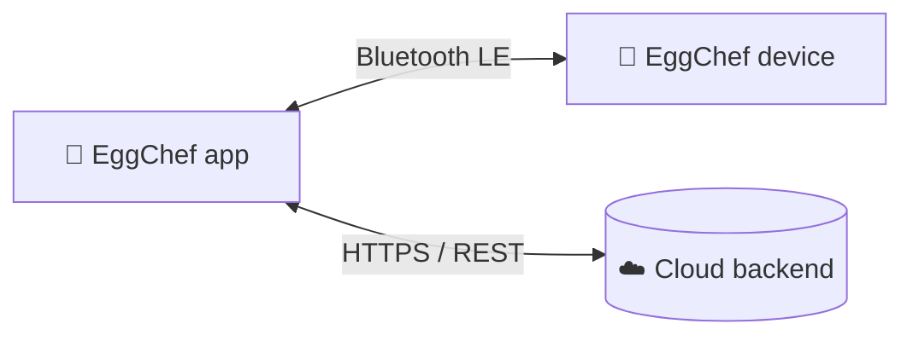

# API & device contract

EggChef talks to **two** systems. **Both are mocked in the app today** so you can run the full experience without hardware or a server. This document is the **contract** — build the real implementations to match it, and the UI won't have to change.



- [What's mocked, and where](#whats-mocked-and-where)
- [Part 1 — Device protocol (Bluetooth LE)](#part-1--device-protocol-bluetooth-le)
- [Part 2 — Backend REST API (proposed)](#part-2--backend-rest-api-proposed)
- [Part 3 — In-app data contract (`useSession`)](#part-3--in-app-data-contract-usesession)
- [How to replace a mock with the real thing](#how-to-replace-a-mock-with-the-real-thing)

---

## What's mocked, and where

| Concern | Real source (to build) | Mocked in the app at |
|---|---|---|
| Egg count, water, temperature, stages, timer | BLE device | `src/state/session.tsx` (fixed values + a local timer) |
| Login / account | Backend `POST /auth/login` | `LoginScreen` just navigates onward |
| Cook history | Backend `GET /history` | `HistoryScreen` (hard-coded list) |
| Preferences (language/theme) | Backend `PUT /preferences` | `ProfileScreen` (static) |

Nothing in the UI calls a network or a Bluetooth API yet — so wiring in the real ones is additive.

---

## Part 1 — Device protocol (Bluetooth LE)

The device advertises a single GATT service with three characteristics. Payloads are **UTF-8 JSON** (chosen for readability on a student project; a production device might use a compact binary frame).

### GATT layout

| | UUID (placeholder — set the real ones) | Properties | Purpose |
|---|---|---|---|
| **Service** | `0000eggc-0000-1000-8000-00805f9b34fb` | — | EggChef service |
| **Command** | `0000egg1-…` | Write | App → device commands |
| **Status** | `0000egg2-…` | Notify | Device → app live updates |
| **Info** | `0000egg3-…` | Read | Firmware, serial, model |

### Commands (App → device, write to `Command`)

| Command | Payload | Effect |
|---|---|---|
| `START_COOK` | `{ "cmd": "START_COOK", "doneness": "Katı", "eggCount": 3, "durationSec": 600 }` | Begin cooking |
| `STOP_COOK` | `{ "cmd": "STOP_COOK" }` | Cancel the current cook |
| `GET_STATUS` | `{ "cmd": "GET_STATUS" }` | Ask for an immediate `status` notify |

`doneness` is one of `Rafadan | Kayısı | Katı`. The app already derives `durationSec` from doneness (see [ARCHITECTURE](./ARCHITECTURE.md#state-the-cooking-session)).

### Events (Device → app, notify on `Status`)

The device pushes a `status` object roughly once per second while active:

```jsonc
{
  "type": "status",
  "state": "cooking",        // "idle" | "cooking" | "done" | "error"
  "stage": "Haşlanıyor",     // "Su Alıyor" | "Isınıyor" | "Haşlanıyor"
  "remainingSec": 135,
  "eggCount": 3,
  "waterMl": 65,             // current water in the tank
  "waterLow": false,
  "tempC": 92.4
}
```

Discrete events the app reacts to:

| Event | Example | App reaction |
|---|---|---|
| Water low | `{ "type": "water", "waterLow": true, "waterMl": 5 }` | Show **Su Uyarısı** popup before cooking |
| Stage change | `{ "type": "stage", "stage": "Isınıyor" }` | Update the ring + bubbles |
| Complete | `{ "type": "done" }` | Open **Pişirme tamamlandı** popup |
| Error | `{ "type": "error", "code": "LID_OPEN", "message": "Kapağı kapatın" }` | Surface to the user |

### Suggested client API

When you build it, expose something like this so screens stay simple:

```ts
// src/services/device.ts  (to build)
connect(): Promise<DeviceHandle>
startCook(opts: { doneness: Doneness; eggCount: number; durationSec: number }): Promise<void>
stopCook(): Promise<void>
onStatus(cb: (s: DeviceStatus) => void): () => void   // returns an unsubscribe
```

---

## Part 2 — Backend REST API (proposed)

Base URL: `https://api.eggchef.example` · JSON over HTTPS · Bearer token auth.

### Auth

| Method | Endpoint | Body | Returns |
|---|---|---|---|
| `POST` | `/auth/register` | `{ email, password }` | `201` `{ user, token }` |
| `POST` | `/auth/login` | `{ email, password }` | `200` `{ user, token }` |
| `POST` | `/auth/logout` | — | `204` |

```jsonc
// POST /auth/login → 200
{
  "token": "eyJhbGci…",
  "user": { "id": "u_123", "name": "Ahmet", "email": "ahm****@gmail.com" }
}
```

### Cook history

| Method | Endpoint | Body | Returns |
|---|---|---|---|
| `GET` | `/history` | — | `200` `Cook[]` |
| `POST` | `/history` | `Cook` (without `id`) | `201` `Cook` |

```jsonc
// GET /history → 200
[
  { "id": "c_9", "date": "2026-06-07T15:05:00Z", "eggCount": 6, "doneness": "Katı",   "durationSec": 600 },
  { "id": "c_8", "date": "2026-06-04T07:45:00Z", "eggCount": 4, "doneness": "Kayısı", "durationSec": 480 },
  { "id": "c_7", "date": "2026-06-02T10:37:00Z", "eggCount": 3, "doneness": "Rafadan","durationSec": 360 }
]
```

### Preferences

| Method | Endpoint | Body | Returns |
|---|---|---|---|
| `GET` | `/preferences` | — | `200` `{ language, theme }` |
| `PUT` | `/preferences` | `{ language?, theme? }` | `200` `{ language, theme }` |

### Devices (paired hardware)

| Method | Endpoint | Body | Returns |
|---|---|---|---|
| `GET` | `/devices` | — | `200` `Device[]` |
| `POST` | `/devices` | `{ serial, name }` | `201` `Device` |

```jsonc
// Device
{ "id": "d_1", "serial": "A98S77AFG", "name": "EggChef", "lastSeen": "2026-06-11T09:41:00Z" }
```

### Conventions

- **Auth:** send `Authorization: Bearer <token>` on everything except register/login.
- **Errors:** non-2xx return `{ "error": { "code": "INVALID_CREDENTIALS", "message": "…" } }`.
- **Timestamps:** ISO-8601 UTC.

---

## Part 3 — In-app data contract (`useSession`)

Until the device and backend exist, the UI reads everything from one Context, `useSession()` (`src/state/session.tsx`). This *is* the shape the real services should ultimately feed. See [ARCHITECTURE → State](./ARCHITECTURE.md#state-the-cooking-session) for the full field list.

The mapping is intentionally 1:1:

| UI field | Will come from |
|---|---|
| `count`, `waterLow`, `stage`, `remaining` | BLE `status` events |
| `startCook` / `stopCook` | BLE `START_COOK` / `STOP_COOK` |
| history list | `GET /history` |
| profile, preferences | `GET /me`, `GET /preferences` |

---

## How to replace a mock with the real thing

Because the UI only ever talks to `useSession()`, you swap a mock for a real service **inside the provider** — no screen changes needed:

1. Add a service module, e.g. `src/services/device.ts` (BLE) or `src/services/api.ts` (REST).
2. In `SessionProvider`, call the service and push its results into the existing state instead of the hard-coded values.
3. Keep the public `useSession()` shape identical, so every screen keeps working.

```tsx
// sketch: feeding real device status into the session
useEffect(() => {
  const unsub = device.onStatus((st) => {
    setStage(st.stage);
    setRemaining(st.remainingSec);
    setLowWater(st.waterLow);
  });
  return unsub;
}, []);
```

That's the whole point of the contract: **build outward from these shapes and the app comes alive without a rewrite.**
