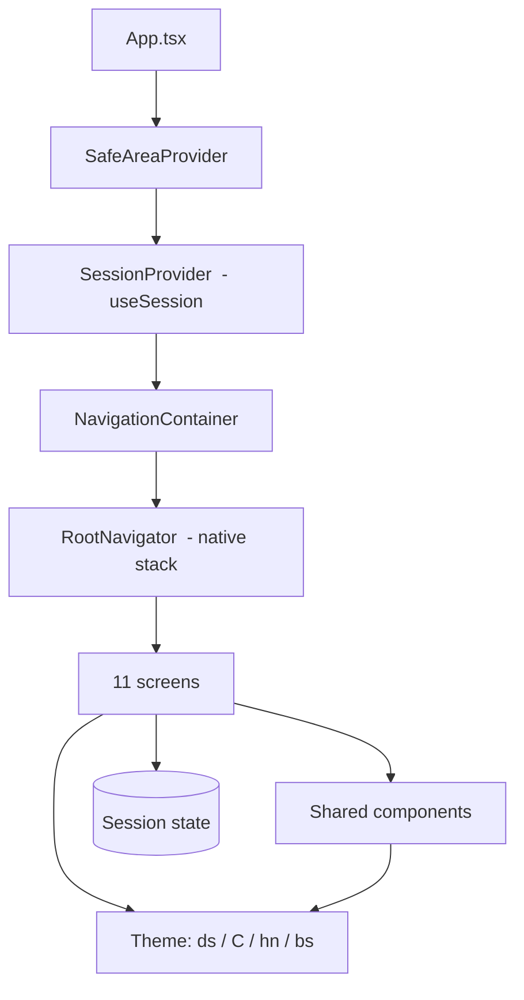
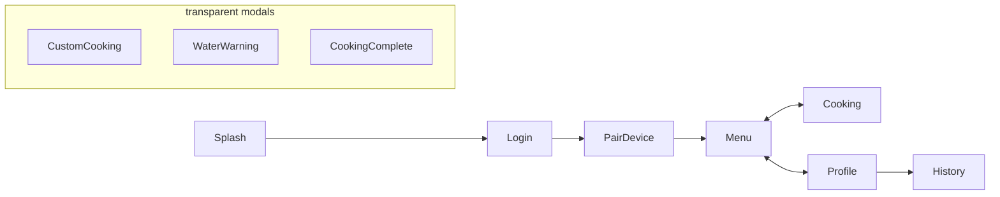

# Architecture

How the EggChef codebase is organized and *why*. Read this before making non-trivial changes. It's the map; the code is the territory.

- [The big picture](#the-big-picture)
- [The scale system (`ds`)](#the-scale-system-ds)
- [Theme: colors, fonts, shadows](#theme-colors-fonts-shadows)
- [Shared components](#shared-components)
- [Navigation](#navigation)
- [State: the cooking session](#state-the-cooking-session)
- [The cooking timer](#the-cooking-timer)
- [Screens](#screens)

---

## The big picture



The app is a thin, declarative UI on top of one shared state object. There's no Redux, no data-fetching layer yet (the backend is mocked) — just **Context + components + a theme**.

Layers, bottom-up:

1. **Theme** (`src/theme`) — the design primitives every component uses.
2. **Components** (`src/components`, `src/icons`) — reusable building blocks.
3. **State** (`src/state/session.tsx`) — the single cooking-session Context.
4. **Screens** (`src/screens`) — one file per screen, composed from the above.
5. **Navigation** (`src/navigation`) — wires the screens together.

---

## The scale system (`ds`)

**The most important thing to understand.** The Figma artboards are **402 × 874 px** (a full-screen iPhone frame). To make the UI look *identical* to the design on any phone, every dimension is multiplied by `screenWidth / 402`.

```ts
// src/theme/scale.ts
export const DESIGN_W = 402;
export const S = Dimensions.get('window').width / DESIGN_W;
export const ds = (n: number) => Math.round(n * S * 1000) / 1000; // design px → device dp
```

So a button that's `336 px` wide in Figma is `width: ds(336)`. On a 390-pt-wide iPhone that renders as `336 × 390/402 ≈ 326 dp`, keeping the proportions exact.

> **Rule:** if a number describes a *size, position, padding, radius, or font size*, wrap it in `ds()`. The only exceptions are `flex`, opacity, and unitless ratios.

---

## Theme: colors, fonts, shadows

Three tiny modules, used everywhere:

**Colors** — `src/theme/colors.ts` exports `C`, the bordo palette:

```ts
C.bg          // #faf9f9  app background
C.bordo       // #5a1520  deepest accent (egg count, highlights)
C.bordoMid    // #8a2032  the "EggChef" wordmark
C.bordoBright // #ad283e  primary button base
C.gray, C.grayLight, C.panel, C.panelTint, C.black, C.white
```

**Fonts** — `src/theme/fonts.ts` exports `hn(weight)`, which maps a design weight to a **Helvetica Neue** family (a native iOS font, so nothing is bundled):

```ts
hn(100) // HelveticaNeue-Thin     hn(300) // HelveticaNeue-Light
hn(400) // HelveticaNeue          hn(500) // HelveticaNeue-Medium
```

Prefer the `<Txt size weight color>` component over raw `<Text>` — it applies `hn()` and `ds()` for you.

**Shadows** — `src/theme/shadow.ts` exports `bs()`, which turns a CSS-style shadow string into a scaled React Native `boxShadow`:

```ts
boxShadow: bs('0 4px 4px rgba(0,0,0,0.25)')           // single
boxShadow: bs('0 8px 16px -5px rgba(138,32,50,0.5)')  // with spread
```

---

## Shared components

| Component | Purpose |
|---|---|
| `Txt` | `<Text>` with `hn()` font + `ds()` sizing. Props: `size`, `weight`, `color`, `ls`, `lh`, `center`. |
| `Screen` | Full-bleed page wrapper. `padTop={false}` lets the header own the safe-area top. |
| `AppHeader` | The white top bar — "EggChef" wordmark + "Merhaba, Ahmet!". Sits behind the status bar. |
| `BottomNav` | The 3-tab dock. The **active tab rises into an elevated circle**. `active` + `onNavigate` props. |
| `EggDial` | The big circle with 6 eggs and the `N adet` readout. Memoized. |
| `Gradient` | `LinearGrad` (CSS-angle → expo-linear-gradient) and `RadialBg` (radial gradient via SVG). |
| `icons/index.tsx` | The full SVG icon set; each icon takes `{ size, color, sw }`. |

---

## Navigation

One **native stack** (`@react-navigation/native-stack`) defined in `src/navigation/RootNavigator.tsx`.



- **Menu / Cooking / Profile** are normal stack routes; each renders its own floating `<BottomNav>`, and tapping a tab calls `navigation.navigate(...)` via the `tabRoute()` helper (`src/navigation/helpers.ts`).
- **CustomCooking / WaterWarning / CookingComplete** are in a `Stack.Group` with `presentation: 'transparentModal'` — they render as **popups** over the screen behind them.
- Route names + params are typed in `src/navigation/types.ts` (`RootStackParamList`). Add new routes there so `navigation.navigate('X')` stays type-checked.

---

## State: the cooking session

All cross-screen state lives in one Context — `src/state/session.tsx` — read via `useSession()`:

```ts
const s = useSession();

s.count          // number  — detected egg count (mocked: 3)
s.doneness       // 'Rafadan' | 'Kayısı' | 'Katı'
s.setDoneness(d)
s.timeLabel      // "8 Dakika" — derived from doneness
s.durationSec    // doneness duration in seconds (6/8/10 min)
s.lowWater       // boolean — gates the water warning
s.refillWater()
s.water          // "~65 ml"
s.customMin, s.customSec, s.setCustom(m, s)

// the active cook
s.cookActive     // boolean
s.cookTotal      // seconds
s.cookStartedAt  // ms epoch
s.startCook(totalSec)
s.stopCook()
```

> **Doneness drives the cook.** `Rafadan → 6 min`, `Kayısı → 8 min`, `Katı → 10 min` (`DONENESS_MIN` in `session.tsx`). Changing the preset updates both the Menu's estimate *and* the actual countdown.

---

## The cooking timer

Worth its own section, because it's the trickiest bit and the source of a bug we fixed.

- A cook **only** runs after `startCook(totalSec)` (called by Menu's *Başlat*, the Custom popup's *Uygula*, or the Cooking screen's own *Başlat*).
- The remaining time is **computed from `cookStartedAt`**, not stored and decremented:
  ```ts
  const elapsed   = Math.floor((Date.now() - cookStartedAt) / 1000);
  const remaining = Math.max(0, cookTotal - elapsed);
  ```
  The Cooking screen just re-renders once a second to refresh the display. Because the source of truth is a timestamp, the cook **keeps ticking across tab switches** and **never auto-starts** just because you opened the Cooking tab.
- At `remaining === 0`, the Cooking screen opens the `CookingComplete` popup; *Tamam* calls `stopCook()` and returns to Menu.
- The **progress ring sweeps counter-clockwise** from the top (an SVG arc `Path`, not a dashed circle), and three stage bubbles (water → heat → boil) sit on the ring.

---

## Screens

| Screen | File | Notes |
|---|---|---|
| Splash | `SplashScreen` | Bordo gradient; auto-advances to Login |
| Login | `LoginScreen` | Email / şifre fields, *Giriş Yap* |
| Pair Device | `PairDeviceScreen` | Animated BLE pulse rings + found-device card |
| Menu / Home | `MenuScreen` | Egg dial, presets, water/time card, *Başlat* |
| Cooking | `CookingScreen` | Countdown ring + stages; idle when no cook is running |
| Custom (popup) | `CustomCookingScreen` | Dakika/saniye picker + 5/10/15 dk chips |
| Water warning (popup) | `WaterWarningScreen` | Shown when `lowWater` and you press *Başlat* |
| Complete (popup) | `CookingCompleteScreen` | "Pişirme tamamlandı" |
| Profile | `ProfileScreen` | Avatar, preferences, history link |
| History | `HistoryScreen` | Plain list of past cooks |

Each screen is self-contained and composes the theme + shared components. Start from the closest existing screen when adding a new one.
